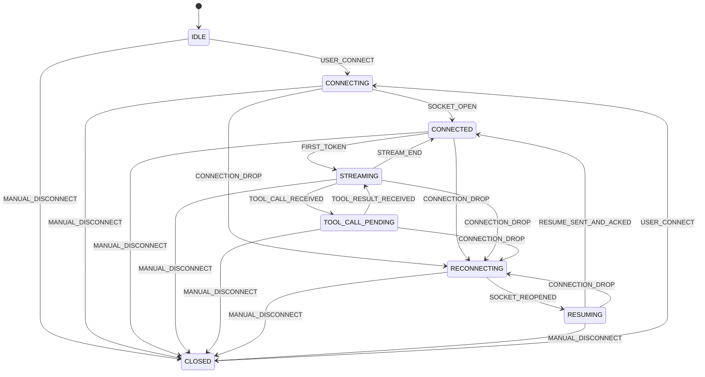

<div align="center">

# 🛰️ Agent Console

### A real-time AI agent monitor that treats streaming as a distributed-systems problem — with a render loop attached.

**Next.js 16 · App Router · TypeScript (strict) · Zustand + Immer · Zero AI-SDK helpers**

Streams tokens. Freezes mid-sentence for tool calls. Diffs half-megabyte context payloads.
Survives dropped sockets, shuffled `seq`, duplicate frames, latency spikes, and corrupt heartbeats — **without losing a single token.**

`ws://localhost:4747/ws` → token stream → tool interrupts → context diffs → trace timeline

</div>

---

> **TL;DR for reviewers**
> The hard part of this brief isn't the UI — it's the wire. A pure-TypeScript `WSStateMachine` + `SeqBuffer` core handles ordering, dedup, and reconnection **outside React**, so the render layer never sees an out-of-order frame. Control responses (`PONG`, `TOOL_ACK`) are answered *before* the reorder buffer, so chaos can never push them past their deadlines. Run `npm run verify` and read the `/log` verdict tally instead of taking my word for it.

---

## ⚡ 60-second start

```bash
# 1 ── Backend (in ../agent-server, Node ≥ 20)
npm install
npm run dev          # normal mode  → ws://localhost:4747/ws
npm run dev:chaos    # chaos mode   → drops · reorder · dupes · latency · corrupt PING

# 2 ── Frontend (in ./agent-console)
npm install
npm run dev          # → http://localhost:3000  → click "Connect"

# 3 ── Prove it works (server must be running)
npm run verify       # drives 6 multi-turn scenarios, prints the /log verdict tally
```

Production build: `npm install && npm run build && npm start` — no manual steps, no env vars.

---

## 🧠 Architecture in three sentences

The app is built around a **pure TypeScript `WSStateMachine` + `SeqBuffer` core** that resolves all protocol complexity — ordering, deduplication, reconnection, replay — completely independent of React. A `WSClient` class owns the socket lifecycle and feeds a **Zustand + Immer** store through a single `useWebSocket` hook, keeping every component declarative and free of socket logic. The three-panel UI (**Context Inspector · Chat · Trace Timeline**) renders with virtual windowing and `React.memo` so it sustains 30+ events/sec without ever re-rendering the full list.

---

## 🔬 Protocol compliance — verified, not claimed

Two guarantees do the heavy lifting. Both are covered by unit tests **and** an end-to-end harness that drives the real server and audits its `/log`:

<table>
<tr><td><b>1 · Per-turn <code>seq</code> reset</b></td>
<td>The server restarts <code>seq</code> at <code>0</code> on <i>every</i> <code>USER_MESSAGE</code> and clears replay history. The client mirrors this with <code>WSClient.beginTurn()</code> before each send. Without it, the 2nd+ responses (restarting at seq 1) would be silently dropped by the dedup buffer as "already seen" — the difference between a one-shot demo and a real multi-turn console.</td></tr>
<tr><td><b>2 · Out-of-band control responses</b></td>
<td><code>PONG</code> (echoing the challenge, including the empty-string chaos variant) and <code>TOOL_ACK</code> are answered the instant they hit the wire — <i>before</i> the ordering buffer — so reordering and latency spikes can never push them past the 3 s / 5 s deadlines. Each is deduped by <code>seq</code> / <code>call_id</code> so replays never emit a second response the server would score <code>unexpected</code>.</td></tr>
</table>

```text
normal  → 6/6 turns rendered tokens · zero breaches · PASS
chaos   → all turns render · zero CLIENT breaches across randomized profiles
          (≈1 in 6 sessions the server logs one TOOL_ACK_TIMEOUT — a server-side
           reorder-buffer / ack-wait deadlock no client can prevent; see
           DECISIONS.md §7, the protocol flaw the brief asks you to find ⚑)
```

---

## 🗺️ Connection state machine



> On reconnect the client transitions `RECONNECTING → RESUMING` and sends `RESUME { last_seq }` as the **first frame** on the new socket — *before* draining any buffered events. That ordering is deliberate: `last_seq` is the highest seq the **DOM has consumed**, not the highest the socket received.

---

## 🧩 What's built — mapped to the brief

| # | Task | What lands in the UI |
|---|------|----------------------|
| **1** | **Streaming chat + tool interrupts** | Tokens render incrementally; on `TOOL_CALL` the in-progress text **freezes with zero reflow**, a card appears below, `TOOL_ACK` fires < 2 s, and on `TOOL_RESULT` the stream resumes with no gap or duplicate. Sequential tool calls **stack**, never overwrite. |
| **2** | **Agent trace timeline** | Every event becomes a row; consecutive tokens collapse into one expandable *"Streamed 47 tokens (1.2s)"* row; `TOOL_CALL`/`TOOL_RESULT` are visually linked by `call_id`; **bidirectional click** between chat and timeline; filter-by-type + content search; virtualized so 30+ ev/sec stays smooth. |
| **3** | **Context inspector** | Syntax-highlighted tree view; subsequent snapshots (same `context_id`) render an **added / removed / changed diff**; a **history scrubber** steps through snapshots; lazy expansion keeps 500 KB+ payloads interactive. |
| **4** | **Reconnection + state recovery** | Non-blocking indicator < 500 ms; exponential backoff **500 ms → 1 → 2 → 4 → cap 10 s**; `RESUME` first; replayed events reordered, deduped, stitched in with no jump; mid-tool-call drops keep the card in a **waiting** state until the replayed `TOOL_RESULT` lands. |
| **5** | **Chaos survival** | Drops, shuffled `seq`, duplicates, rapid double tool calls, 500 KB context, and empty-challenge `PING` all handled without a crash or inconsistent DOM. *(Recording — see below.)* |

---

## 🎬 Required media — ⚠️ action before submitting

The brief marks these **mandatory**; they can only be captured by a human running the app, so they're not in the repo yet.

**Three normal-mode screenshots** (drop in `docs/`, link here): (a) streamed response **with a tool call**, (b) the **trace timeline** mid-stream, (c) the **context inspector** showing a diff.

**A 3–5 min chaos recording** (YouTube unlisted / Loom / `.mp4`). Run `npm run dev:chaos`, keep `GET http://localhost:4747/log` on screen, and narrate each scenario:

| Scenario | Trigger / what to show |
|----------|------------------------|
| Connection drop mid-stream | Send `long detailed document`; on drop, amber banner appears, chat stays interactive, stream resumes after `RESUME` |
| Out-of-order messages | Any prompt; the `reorder` counter ticks while text still renders correctly |
| Rapid tool calls | Send `analyze and compare`; two stacked tool cards both resolve |
| 500 KB+ context payload | Send `schema database`; context tree stays interactive, chat doesn't freeze |
| Corrupt `PING` (empty challenge) | A `PONG echo "" (corrupt PING)` row appears in the trace, no crash |

---

## 🛠️ Commands

```bash
npm run dev            # Next.js dev server → http://localhost:3000
npm run build && npm start   # production
npm test               # Jest unit suites (seqBuffer · jsonDiff · stateMachine · wsClient)
npm run verify         # end-to-end /log audit against the live server
npx tsc --noEmit       # strict type-check
```

---

## 📂 Project structure

```
src/
├── components/
│   ├── chat/        ChatPanel · MessageBubble · StreamingText · ToolCallCard
│   ├── timeline/    TraceTimeline · TimelineRow · TokenBatch
│   ├── context/     ContextInspector · JsonDiffTree · ContextScrubber
│   └── connection/  ConnectionIndicator
├── hooks/
│   ├── useWebSocket.ts   React ↔ WSClient bridge
│   └── useTimeline.ts    filtered + batched timeline state
├── lib/
│   ├── wsStateMachine.ts  pure state machine
│   ├── seqBuffer.ts       reorder + dedup buffer
│   ├── wsClient.ts        socket manager (per-turn reset, out-of-band control)
│   ├── metricsTracker.ts  live protocol metrics
│   ├── jsonDiff.ts        JSON diff engine
│   └── virtualList.ts     virtual windowing
├── store/agentStore.ts    Zustand + Immer store
├── tests/                 seqBuffer · jsonDiff · wsStateMachine · wsClient
├── types.ts               all app types
└── types/unsafe.ts        the ONLY file permitted to use `any`

verify-protocol.mjs        end-to-end harness: drives the real server, audits /log
```

---

## ✅ Constraints honored

`Next.js 16 App Router` (no Pages Router) · `strict: true`, no `@ts-ignore`, `any` quarantined to one documented file · **no `vercel/ai`, no langchain, no AI-SDK streaming helpers — the renderer is built from scratch.** State lives in Zustand + Immer; the rationale is in [`DECISIONS.md`](DECISIONS.md).

<div align="center">

**Read [`DECISIONS.md`](DECISIONS.md) for the seq-ordering data structure, the layout-shift strategy, the consumed-vs-received recovery model, the 50-stream / 100×-length scaling answers, and §7 — the protocol race the brief dares you to find.**

</div>
