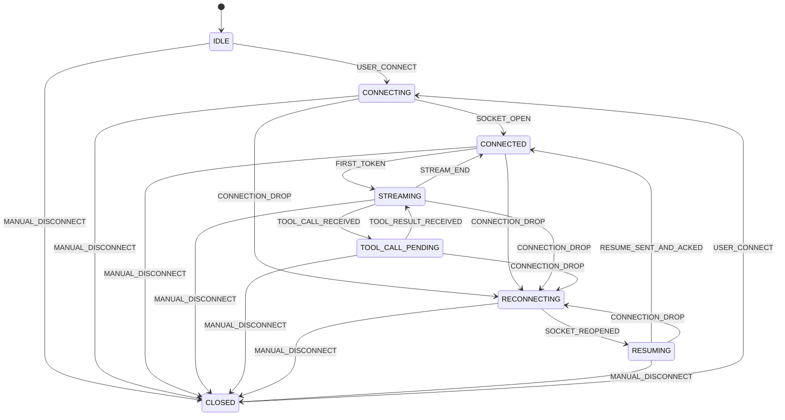

# Agent Console

A production-grade Next.js (App Router) application for real-time agent monitoring. Connects to a WebSocket backend at `ws://localhost:4747/ws` and renders streaming token output, tool call interruptions, context snapshots, and a full trace timeline — all while handling chaos: connection drops, out-of-order messages, duplicate events, rapid tool calls, oversized payloads, and corrupt heartbeats.

## Protocol compliance — verified, not just claimed

Two protocol guarantees do the heavy lifting; both are covered by unit tests **and** an end-to-end harness that drives the real server and audits its `/log`:

1. **Per-turn seq reset.** The server restarts its `seq` counter at `0` on *every* `USER_MESSAGE` and clears its replay history. The client mirrors this with `WSClient.beginTurn()` before each send — without it, the 2nd and later responses (which restart at seq 1) would be silently discarded by the dedup/reorder buffer as "already seen". This is the difference between a one-shot demo and a real multi-turn console.

2. **Out-of-band, deduplicated control responses.** `PONG` (echoing the challenge, including the empty-string chaos variant) and `TOOL_ACK` are answered the instant they arrive on the wire — *before* the ordering buffer — so chaos-mode reordering and latency spikes can never push us past the 3 s / 5 s deadlines. Each is deduplicated by `seq` / `call_id`, so duplicate deliveries and post-reconnect replays never emit a second response (which the server would score as `unexpected`).

```bash
# Start the server (see agent-server/), then:
npm run verify          # → drives 6 multi-turn scenarios, prints /log verdict tally
```

Result against the live server (`/log` verdicts):

```
normal  → 6/6 turns rendered tokens · zero breaches · PASS
chaos   → all turns render · zero CLIENT breaches across randomized profiles
          (≈1 in 6 sessions the server logs one TOOL_ACK_TIMEOUT — a server-side
           reorder-buffer/ack-wait deadlock that no client can prevent; see
           DECISIONS.md §7, the protocol flaw the brief asks you to find)
```

## Architecture

The app is built around a pure TypeScript `WSStateMachine` + `SeqBuffer` core that handles all protocol complexity independent of React. A `WSClient` class manages the socket lifecycle and wires into a Zustand store via a `useWebSocket` hook, keeping React components declarative and free of socket logic. The three-panel UI (Context Inspector / Chat / Trace Timeline) renders with virtual windowing and React.memo to sustain high token throughput without full-list re-renders.

## State Machine



## Running

### Development

```bash
# Install dependencies
npm install

# Start the Next.js dev server
npm run dev
# → http://localhost:3000

# Run tests
npm test

# Type-check
npx tsc --noEmit
```

### With the Agent Server

The backend lives in `../agent-server` (Node ≥ 20, `ws`). From that folder:

```bash
npm install
npm run dev          # normal mode  → ws://localhost:4747/ws
npm run dev:chaos    # chaos mode   → drops / reorder / dupes / latency / corrupt PING

# health / log / reset endpoints
#   GET http://localhost:4747/health
#   GET http://localhost:4747/log
#   GET http://localhost:4747/reset
```

Then start the frontend (`npm run dev` → http://localhost:3000) and click **Connect**, or run `npm run verify` for an automated end-to-end pass.

### Build for production

```bash
npm run build
npm start
```

## Required media — ACTION REQUIRED before submitting

The assignment treats these as **mandatory deliverables**; a submission without the recording is marked incomplete. They can only be captured by a human running the app, so they are not in this repo yet:

**1. Three normal-mode screenshots** (add to a `docs/` folder and link them here):
- (a) a streamed response **with a tool call** (chat panel)
- (b) the **trace timeline** mid-stream
- (c) the **context inspector** showing a diff between two snapshots

**2. A 3–5 minute chaos-mode screen recording** (YouTube unlisted / Loom / `.mp4` in repo, link in the submission email). Run `npm run dev:chaos` and narrate each scenario as it happens:

| Scenario | How to trigger / what to show |
|----------|-------------|
| Connection drop mid-stream | Send `long detailed document`; when it drops, amber banner appears, chat stays interactive, stream resumes after RESUME |
| Out-of-order messages | Any prompt; watch the `reorder` counter tick while text still renders correctly |
| Rapid tool calls | Send `analyze and compare`; two stacked ToolCallCards both resolve |
| 500KB+ context payload | Send `schema database`; context tree stays interactive, chat doesn't freeze |
| Corrupt PING (empty challenge) | Wait for a PING with empty challenge; a `PONG echo "" (corrupt PING)` row appears in the trace, no crash |

Keep `GET http://localhost:4747/log` visible during the recording — narrating the `"ok"` verdicts is strong evidence of protocol compliance.

## Trace timeline is bidirectional

Click any tool-call card in the chat → the trace timeline scrolls to and highlights its `TOOL_CALL`/`TOOL_RESULT` rows. Click a timeline row → the matching chat message (by `call_id` or `stream_id`) highlights and scrolls into view. Both client-sent `PONG` and `RESUME` frames appear as their own rows, so the trace shows both directions of the conversation.

## Project Structure

```
src/
├── components/
│   ├── chat/           ChatPanel, MessageBubble, StreamingText, ToolCallCard
│   ├── timeline/       TraceTimeline, TimelineRow, TokenBatch
│   ├── context/        ContextInspector, JsonDiffTree, ContextScrubber
│   └── connection/     ConnectionIndicator
├── hooks/
│   ├── useWebSocket.ts  React ↔ WSClient bridge
│   └── useTimeline.ts   Filtered + batched timeline derived state
├── lib/
│   ├── wsStateMachine.ts  Pure state machine
│   ├── seqBuffer.ts       Reorder + dedup buffer
│   ├── wsClient.ts        WebSocket manager (per-turn reset, out-of-band control)
│   ├── metricsTracker.ts  Live protocol metrics (compliance, latency, chaos)
│   ├── jsonDiff.ts        JSON diff algorithm
│   └── virtualList.ts     Virtual windowing utilities
├── store/
│   └── agentStore.ts   Zustand store with Immer
├── tests/
│   ├── seqBuffer.test.ts
│   ├── jsonDiff.test.ts
│   ├── wsStateMachine.test.ts
│   └── wsClient.test.ts   beginTurn reset + out-of-band PONG/ACK dedup + RESUME
├── types.ts            All application TypeScript types
└── types/
    └── unsafe.ts       ONLY file permitted to use `any`

verify-protocol.mjs     End-to-end harness: drives the real server, audits /log
```
